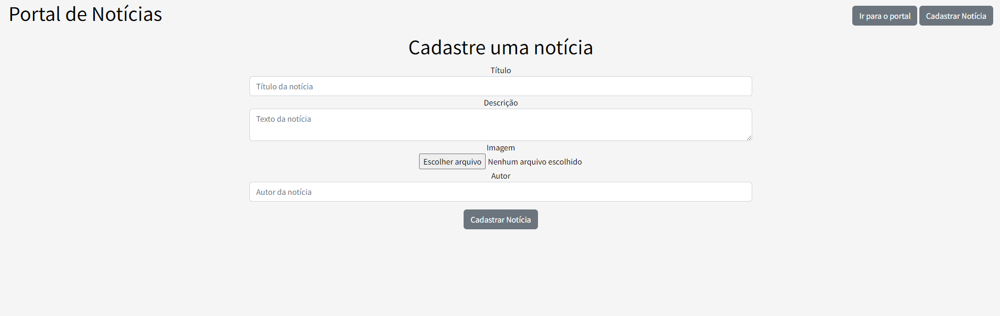
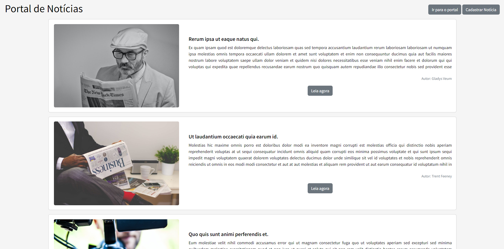
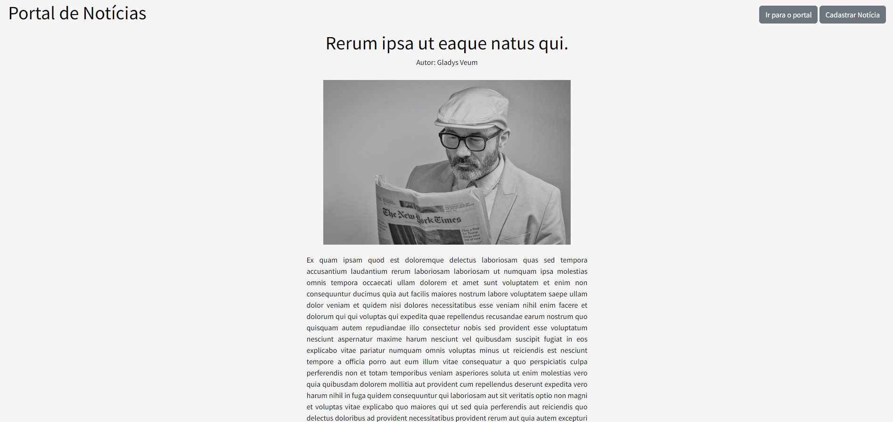

# Cadastro de notícias em Laravel

Ferramenta que permite:  

• Cadastro de uma notícia;  
• Listagem das notícias cadastradas;  
• Visualização da notícia.  

Para deixar o projeto funcionando é necessário rodar os seguintes comandos:
```
php artisan migrate

php artisan db:seed
```

Tela de cadastro:  
  

Lista de notícias:  


View da notícia:  
  

